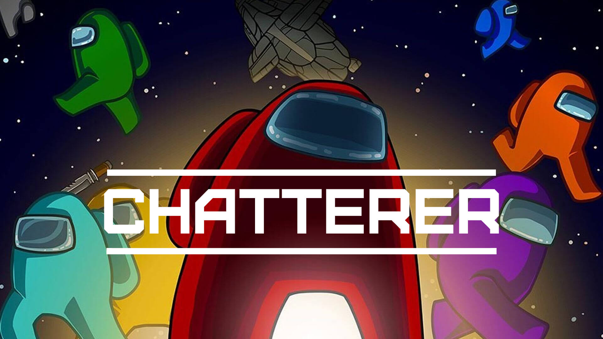

[](https://api.travis-ci.org/nejdetkadir/socketio-live-amongus)
[](https://app.codacy.com/gh/nejdetkadir/socketio-live-amongus?utm_source=github.com&utm_medium=referral&utm_content=nejdetkadir/socketio-live-amongus&utm_campaign=Badge_Grade)

# chatterer-among-us
This is a simple chat application. When application is started, you must write an username then the application will start. You are free now, Enjoy it!



# Project setup
### Prerequirites
- NodeJS (>=10.x)
- npm
- bower

### Installation
- Install node dependencies:
``` bash 
$ npm install
```
- Install bower dependencies:
``` bash 
$ bower install
```
- If you want to use localhost or any server, you must change url from /public/javascripts/controller/indexController.js:29
```javascript
const url = 'https://socketio-live-amongus.herokuapp.com';
``` 
- Run
``` bash 
$ npm start
```

# Demo
[Live demo on Heroku](https://socketio-live-amongus.herokuapp.com)

# License
This Application is licensed under the  Apache-2.0 License.
